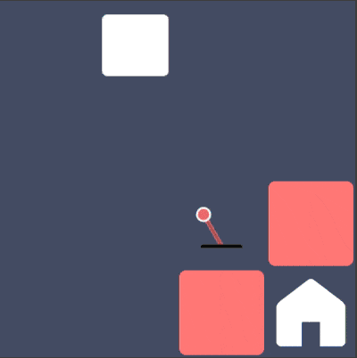

Prism is back. After two years, one unsuccesful name change (RIP *Iris*), and countless hours of self-reflection, we've decided to finally give our old game the treatment it deserves.

I guess some background is in order. During the Spring of 2016, the founding members of S & P Games developed Prism for the Oberlin College game development course. Prism is a top-down, grid-based, 2D puzzle game with simple goal: navigate the player sprite from its starting position to an end position. To do so, the player must navigate through a series of colored blocks.

By flipping a switch, the color of that switch is added to the background color. Switch a blue switch, the background color becomes blue. Then switch a red switch, and the red is added to the already switched blue, making the background color purple. Unswitch the red switch, and only the blue remains, so the background is blue, and so on. If a block is of the same color as the background, it 'blends' into the board, allowing the player to pass through it. Hopefully, this brings them closer to the finish.

That's the basic idea of the game, at least. To get more of a feel for it, and explore some of the more extensive mechanics, [check out the only working build of it in existence](http://cs-361-project.github.io/prism-game/). You may notice a few things right off the bat. It takes ages to load, the menus are weird, some of the graphics are oddly rendered, the list goes on. If you are really perceptive, you might even find a bug in our level indexing. 

We noticed those things too. In fact, we always thought there was more to this game than a slightly buggy, slow Unity build that only existed within the confines of our game design class. And for the last two years, we've been dreaming of a day where we could right those wrongs, at long last giving Prism the time and finesse it truly deserves. This fall, **that time has come**.

We've got a plan: turn Prism into Prism 2.0. We're talking better levels. Slicker UI. More in-game graphics. New soundtrack. Leaderboards. Stat tracking. The whole package. And you, the public, can be a part of it by following this blog.

Part One will be a web build, using a combination of ReactJS, Redux, and canvas elements. Part Two will be a mobile build using Swift.

Until then, hang tight. Play the old build of the game. Get psyched. Send us an email (saltpeppergames@gmail.com). We'd love to hear from you.

*--Salt and Pepper Games*

